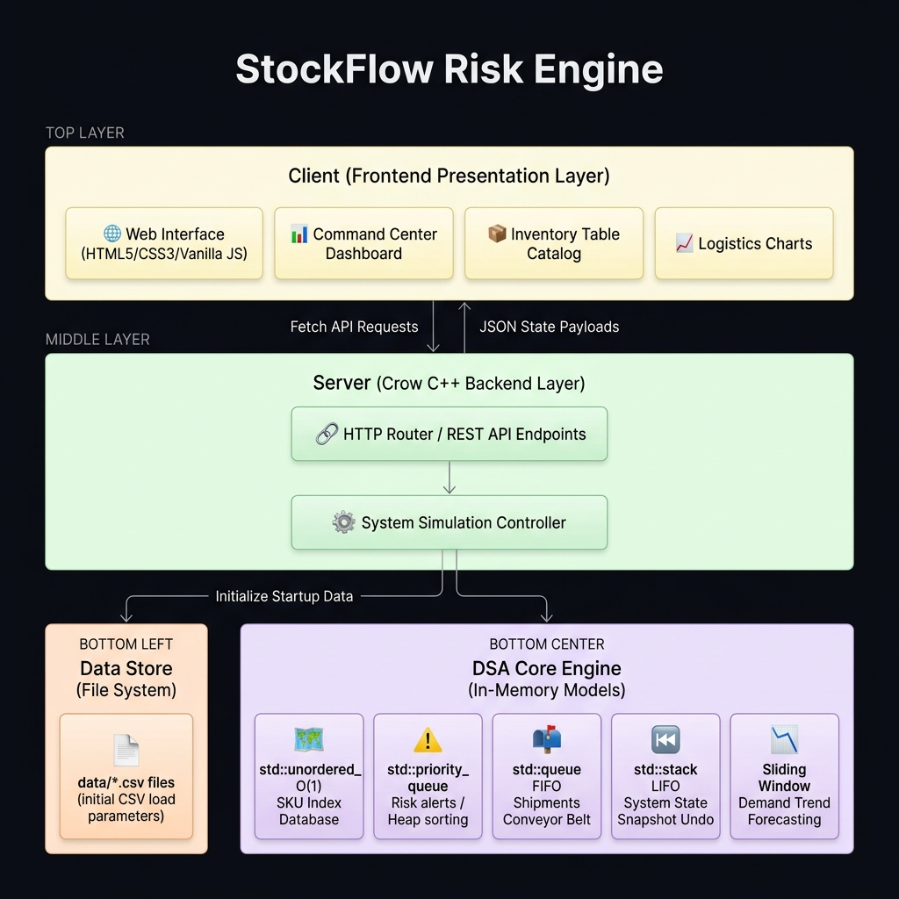
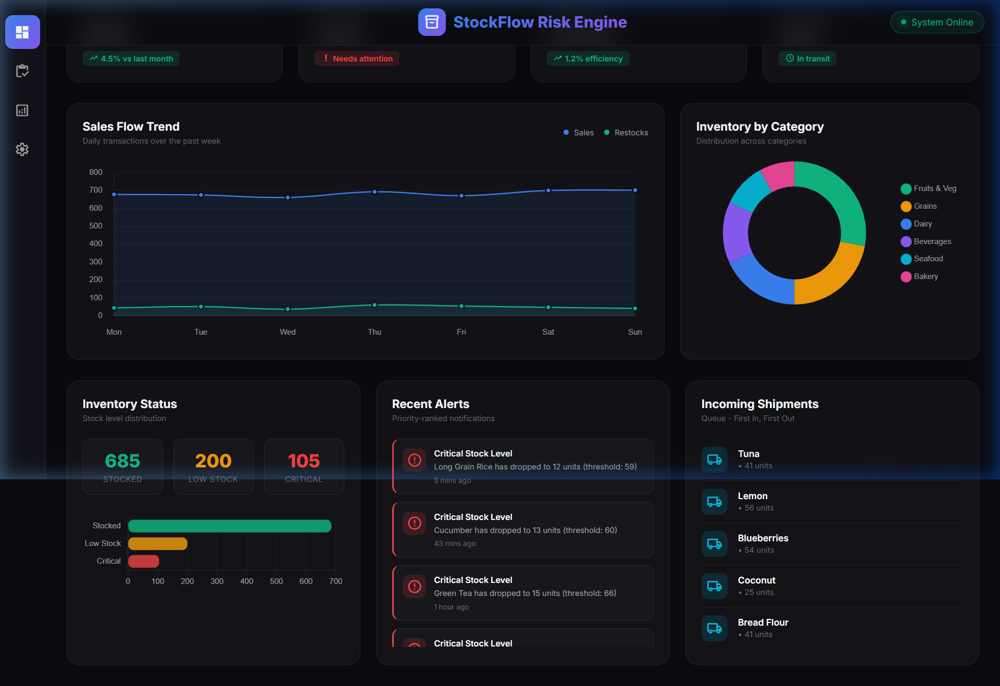
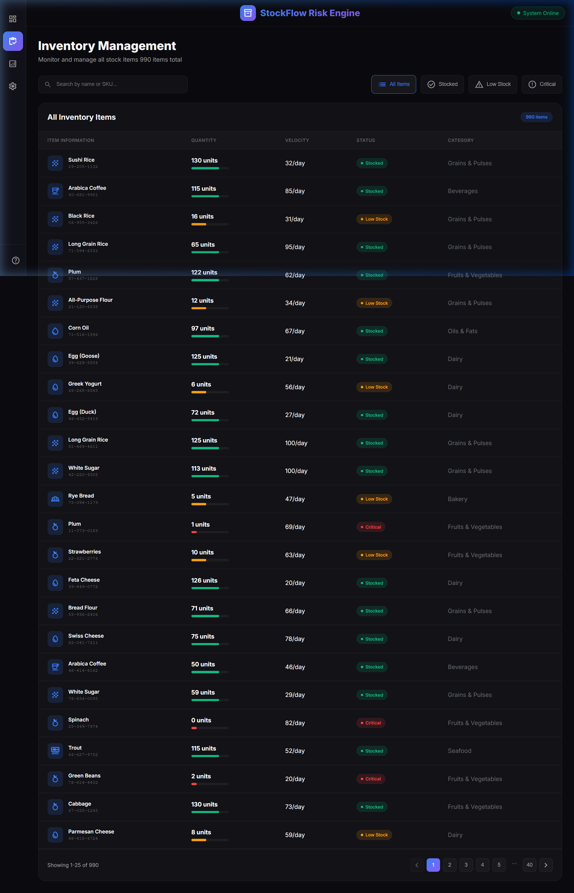
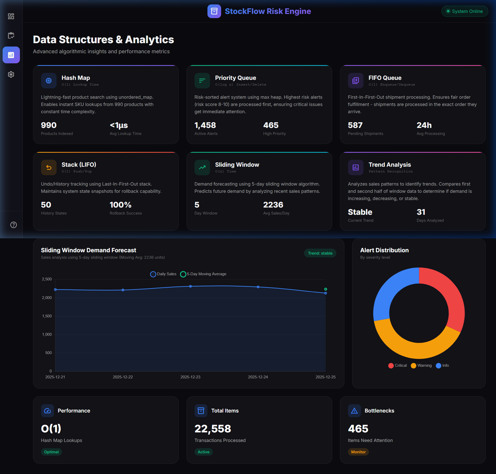
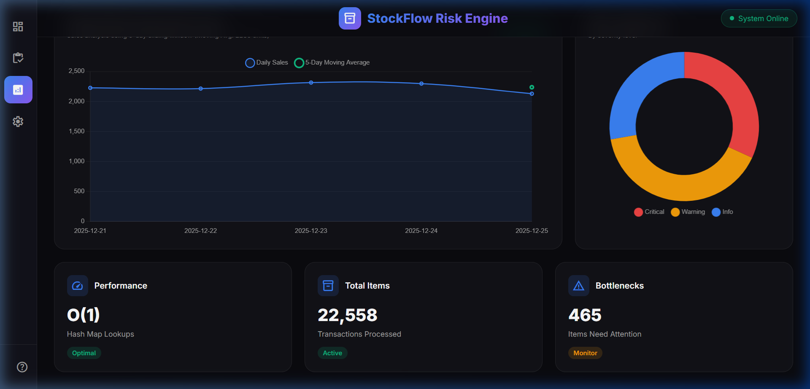
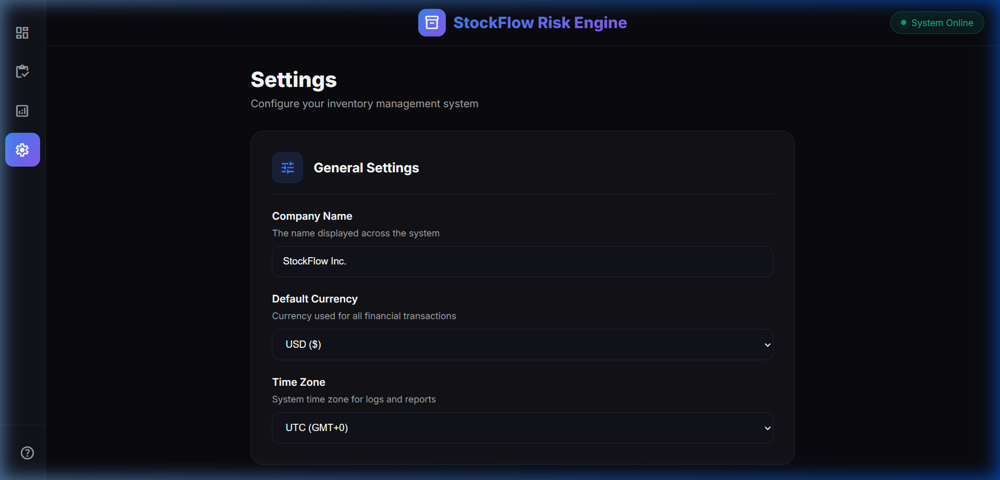

<div align="center">

<br/>

```
███████╗████████╗ ██████╗  ██████╗██╗  ██╗███████╗██╗      ██████╗ ██╗    ██╗
██╔════╝╚══██╔══╝██╔═══██╗██╔════╝██║ ██╔╝██╔════╝██║     ██╔═══██╗██║    ██║
███████╗   ██║   ██║   ██║██║     █████╔╝ █████╗  ██║     ██║   ██║██║ █╗ ██║
╚════██║   ██║   ██║   ██║██║     ██╔═██╗ ██╔══╝  ██║     ██║   ██║██║███╗██║
███████║   ██║   ╚██████╔╝╚██████╗██║  ██╗██║     ███████╗╚██████╔╝╚███╔███╔╝
╚══════╝   ╚═╝    ╚═════╝  ╚═════╝╚═╝  ╚═╝╚═╝     ╚══════╝ ╚═════╝  ╚══╝╚══╝
```

### **Supply Chain Risk Engine — Powered by C++ & Data Structures**

<br/>

[](https://isocpp.org/)
[](https://crowcpp.org/)
[](https://cmake.org/)
[](https://vcpkg.io/)
[](https://mustache.github.io/)
[]()
[](https://github.com/Asma-Shoukat/StockDS)

<br/>

> *A real-time inventory risk management system demonstrating the practical power of classic Data Structures — built with a high-performance C++ backend (Crow Framework) and a modern glassmorphism web frontend.*

<br/>

</div>

---

## 📌 Table of Contents

- [🎯 Project Objective](#-project-objective)
- [✨ Key Features](#-key-features)
- [🧱 Data Structures & Algorithms](#-data-structures--algorithmic-complexities)
- [🏗️ System Architecture](#️-system-architecture)
- [🖥️ System Interface](#️-system-interface)
- [📂 Project Structure](#-project-structure)
- [⚙️ Setup & Installation](#️-setup--installation)
- [🌐 API Reference](#-api-reference)
- [📊 Dataset](#-dataset)
- [🔮 Future Roadmap](#-future-roadmap)

---

## 🎯 Project Objective

**StockFlow** is a *Data Structures & Algorithms* demonstration project that simulates a real-world retail supply chain. Instead of relying on a conventional database, the **entire system state is maintained in-memory** using carefully selected C++ Standard Library containers, each chosen for a specific algorithmic reason.

The application runs as a live Single Page Application (SPA):

- 📡 **C++ Backend** (Crow Framework) — serves REST APIs and renders Mustache templates
- 🌐 **Modern Web Frontend** — dark-themed glassmorphism UI with Chart.js visualizations
- 🔄 **Background Simulation** — an autonomous timer thread advances simulation days every 5 seconds, triggering sales, shipments, and state updates in real-time

---

## ✨ Key Features

| Feature | Description |
|---|---|
| 🗓️ **Day Simulation** | Advance time by 1 day — triggers sales deduction, shipment arrivals, and queue refills |
| ⏮️ **Time Travel (Undo)** | Roll back to any previous day using a LIFO Stack of full system snapshots |
| 🚨 **Risk Alert Engine** | Max-Heap Priority Queue surfaces the highest-risk items instantly at O(1) |
| 📦 **Inventory Tracking** | O(1) SKU lookup via Hash Map across 990+ product records |
| 🚚 **FIFO Supply Chain** | Shipments processed in First-In-First-Out order via `std::queue` |
| 📉 **Demand Forecasting** | Sliding Window algorithm computes 5–7 day moving average and trend direction |
| ⚙️ **Live Settings** | Company name, stock thresholds, and forecast window — saved to disk and live-applied |
| 🤖 **Auto-Advance Timer** | Background `std::thread` simulates real-time logistics every 5 seconds |

---

## 🧱 Data Structures & Algorithmic Complexities

The entire engine is built on five DSA pillars. Each was chosen for a concrete algorithmic reason — not convenience.

| Module | Data Structure | Complexity | Justification |
|:---|:---|:---:|:---|
| **Inventory Database** | `std::unordered_map<string, StockItem>` | $O(1)$ avg | Constant-time product lookup by SKU ID across 990 items. A `vector` would give $O(n)$ per search. |
| **Risk & Shortage Alerts** | `std::priority_queue<Alert>` (Max-Heap) | $O(\log N)$ insert | The highest-risk alert (by `risk_score`) is always at the top in $O(1)$ time. Critical items are never buried. |
| **Supply Chain Pipeline** | `std::queue<Shipment>` (FIFO) | $O(1)$ enqueue/dequeue | Physically mirrors real logistics: shipments ordered first must arrive first. No random-access needed. |
| **State History / Undo** | `std::stack<SystemState>` (LIFO) | $O(1)$ push/pop | Full inventory + alert snapshots are pushed on each day-advance. One pop = instant rollback. |
| **Demand Forecasting** | Sliding Window over `dailySalesList` | $O(K)$ where K = window | Analyzes the last K days to compute a moving average. Splits the window to determine if demand is Increasing, Decreasing, or Stable. |

### How `risk_score` is Computed

```cpp
if (item.status == "Critical")  item.risk_score = 80 + (item.velocity / 10);
else if (item.status == "Low")  item.risk_score = 50 + (item.velocity / 10);
else                            item.risk_score = 20;
```

Items with high velocity (fast-selling) and low stock get the highest risk scores, floating them to the top of the Priority Queue automatically.

### Sliding Window Trend Detection

```cpp
// Splits the window in half — compares first-half avg vs second-half avg
if (secondAvg > firstAvg * 1.05)       return "increasing";
else if (secondAvg < firstAvg * 0.95)  return "decreasing";
else                                    return "stable";
```

---

## 🏗️ System Architecture

StockFlow uses a modular decoupling architecture separating the high-speed data engine from the web presentation layers:



### Layer Breakdown

```
┌─────────────────────────────────────────────────────────────────┐
│              CLIENT  (Frontend Presentation Layer)              │
│  HTML5 Templates  │  Chart.js Visuals  │  Vanilla JS fetch()   │
└──────────────────────────┬──────────────────────────────────────┘
                           │  HTTP Requests / JSON Responses
┌──────────────────────────▼──────────────────────────────────────┐
│              SERVER  (Crow C++ Backend — Port 8080)             │
│  REST Router  →  System Simulation Controller  →  API Handlers  │
└───────────┬──────────────────────────────────────┬──────────────┘
            │ Initialize CSV Data                  │ In-Memory
┌───────────▼──────────┐              ┌────────────▼─────────────┐
│   DATA STORE (Files) │              │  DSA CORE ENGINE         │
│  inventory.csv       │              │  unordered_map (O(1))    │
│  alerts.csv          │              │  priority_queue (Heap)   │
│  shipments.csv       │              │  queue (FIFO)            │
│  transactions.csv    │              │  stack (LIFO Undo)       │
│  daily_sales.csv     │              │  Sliding Window          │
│  settings.cfg        │              └──────────────────────────┘
└──────────────────────┘
```

### Tech Stack

| Layer | Technology |
|---|---|
| **Language** | C++17 |
| **HTTP Server** | [Crow Framework](https://crowcpp.org/) — multithreaded microframework |
| **Templating** | Crow Mustache — server-side HTML rendering |
| **Frontend** | HTML5, CSS3 (glassmorphism dark theme), Vanilla JavaScript |
| **Charts** | Chart.js via CDN |
| **Icons** | Google Material Symbols |
| **Fonts** | Google Fonts — Inter |
| **Build** | CMake 3.10+, vcpkg |
| **Concurrency** | `std::thread` + `std::atomic<bool>` for background timer |

---

## 🖥️ System Interface

> The StockFlow UI is a premium dark-themed Single Page Application with glassmorphism cards, animated status indicators, and real-time Chart.js visualizations. All pages share a collapsible sidebar that expands on hover.

---

### 1 · Command Center — Dashboard

The **Dashboard** is the nerve center of the system. It displays four live KPI cards (Total SKUs, Bottlenecks, Avg Flow Rate, Pending Shipments), a Sales Flow Trend line chart, and an Inventory Distribution donut chart. The top-right status pill pulses green to indicate the C++ server is online.

> **DSA in action:** KPI values are computed from the `inventoryList` vector and `shipmentQueue.size()`. The alert panel on the bottom-left is populated by draining a copy of the `priority_queue` — highest-risk items always surface first.



---

### 2 · Warehouse — Inventory Management

The **Inventory** page renders a full searchable table of all 990 SKUs loaded from `inventory.csv`. Each row shows Item Name, SKU ID, Quantity (with a visual progress bar), Velocity (units/day), Stock Status badge, and Category. Filter buttons (`All Items`, `Stocked`, `Low Stock`, `Critical`) allow instant category switching.

> **DSA in action:** Every row is backed by a `StockItem` in `inventoryMap` (Hash Map). The status badge (`Stocked` / `Low` / `Critical`) is computed against configurable thresholds: `criticalStockThreshold` (default 5) and `lowStockThreshold` (default 20).



---

### 3 · Analytics Lab — Data Structures & Analytics

The **Analysis** page is where DSA implementation is made fully visible. Six cards display each data structure's live metrics:

| Card | Data Structure | Live Stats Shown |
|---|---|---|
| **Hash Map** | `unordered_map` | 990 Products Indexed, <1µs Avg Lookup |
| **Priority Queue** | `priority_queue` | Active Alerts, High-Priority Count |
| **FIFO Queue** | `queue` | Pending Shipments, Avg Processing Time |
| **Stack (LIFO)** | `stack` | History States, Rollback Success % |
| **Sliding Window** | Array + Algorithm | Day Window, Avg Sales/Day |
| **Trend Analysis** | Pattern Detection | Current Trend, Days Analyzed |

Below the cards: a **Sliding Window Demand Forecast** line chart overlays Daily Sales vs. 5-Day Moving Average, and an **Alert Distribution** donut chart breaks alerts by severity (Critical / Warning / Info).



---

### 4 · Analytics Lab — Lower Panel (Charts)

The lower section of the Analysis page shows the Sliding Window Demand Forecast chart and Alert Distribution in full, plus three summary stat cards:
- **Performance** — Hash Map Lookups: O(1) Optimal
- **Total Items** — 22,558 Transactions Processed
- **Bottlenecks** — 465 Items Need Attention (Monitor status)



---

### 5 · Settings Panel

The **Settings** page allows live configuration of:
- Company Name
- Low Stock Threshold (units)
- Critical Stock Threshold (units)
- Forecast Window (days)

Changes POST to `/api/save-settings`, which updates the global variables and writes `data/settings.cfg` to disk for persistence across server restarts.



---

## 📂 Project Structure

```
StockDS/
│
├── 📁 src/
│   └── main.cpp                  # 961-line core: structs, DSA logic, routes, timer
│
├── 📁 templates/                 # Crow Mustache HTML templates
│   ├── index.html                # Dashboard — KPI cards, charts, alert panel
│   ├── inventory.html            # Inventory table — 990 SKUs with filter buttons
│   ├── analysis.html             # DSA analytics — 6 structure cards + charts
│   └── settings.html             # Settings form — thresholds & forecast config
│
├── 📁 data/                      # CSV datasets loaded at startup
│   ├── inventory.csv             # 990 products (SKU, name, category, qty, velocity)
│   ├── alerts.csv                # Risk alert records (type, title, risk_score)
│   ├── shipments.csv             # Inbound shipment queue (supplier, date, priority)
│   ├── transactions.csv          # Full transaction history (1.2 MB)
│   ├── daily_sales.csv           # Per-day sales aggregates (for Sliding Window)
│   ├── dashboard_stats.csv       # Seed metrics (total_skus, flow_rate, etc.)
│   └── settings.cfg              # Persisted runtime settings
│
├── 📁 docs/
│   ├── SRS_Analysis_Report.md    # Software Requirements vs Implementation gap analysis
│   └── 📁 screenshots/           # UI screenshots for README
│
├── 📁 build/                     # CMake build output (auto-generated)
├── 📁 vcpkg/                     # vcpkg package manager (Crow dependency)
├── CMakeLists.txt                # Build config — C++17, Crow linkage
├── srs.txt                       # Original Software Requirements Specification
└── run.txt                       # Quick-reference build & run commands
```

---

## ⚙️ Setup & Installation

### Prerequisites

Before building, ensure you have the following installed:

| Tool | Version | Purpose |
|---|---|---|
| **C++ Compiler** | MSVC / GCC / Clang | Compiles C++17 source |
| **CMake** | 3.10+ | Build system generator |
| **vcpkg** | Latest | Package manager for Crow |
| **Git** | Any | Clone repository |

### Step-by-Step Build

**1. Clone the repository**
```powershell
git clone https://github.com/Asma-Shoukat/StockDS.git
cd StockDS
```

**2. Install Crow via vcpkg** *(first time only)*
```powershell
.\vcpkg\bootstrap-vcpkg.bat
.\vcpkg\vcpkg install crow
```

**3. Configure the CMake build**
```powershell
cmake -B build -S . -DCMAKE_TOOLCHAIN_FILE=.\vcpkg\scripts\buildsystems\vcpkg.cmake
```

**4. Build the project**
```powershell
cmake --build build --config Release
```

**5. Run the backend server**
```powershell
.\build\Release\main.exe
```

**6. Open your browser**
```
http://localhost:8080/
```

You will see the server console output confirm all data structures loaded:

```
==========================================================
  STOCKFLOW SERVER - Data Structures Demo
==========================================================
  Data Structures Implemented:
    [+] Hash Map      - O(1) product lookup
    [+] Priority Queue - Risk-sorted alerts
    [+] Queue         - FIFO shipment processing
    [+] Stack         - Undo/History feature
    [+] Sliding Window - Demand forecasting
==========================================================
  Dashboard: http://localhost:8080/
  Inventory: http://localhost:8080/inventory
  Analysis:  http://localhost:8080/analysis
==========================================================
  [AUTO-TIMER] Days advance every 5 seconds
==========================================================
```

> **Tip:** After rebuilding (`cmake --build build --config Release`), simply re-run `.\build\Release\main.exe` and hard-refresh your browser.

---

## 🌐 API Reference

The Crow backend exposes both page routes and REST API endpoints:

### Page Routes

| Method | Route | Template Rendered |
|---|---|---|
| `GET` | `/` | `index.html` — Dashboard |
| `GET` | `/inventory` | `inventory.html` — Inventory table |
| `GET` | `/analysis` | `analysis.html` — DSA analytics |
| `GET` | `/settings` | `settings.html` — Settings form |

### REST API Endpoints

| Method | Endpoint | Description | DSA Used |
|---|---|---|---|
| `GET` | `/api/product/<sku_id>` | Fetch single product by SKU | `unordered_map` O(1) lookup |
| `POST` | `/api/advance-day` | Simulate one day forward | `stack` push + `queue` dequeue |
| `POST` | `/api/undo` | Revert to previous day | `stack` pop |
| `GET` | `/api/alerts?limit=N` | Top-N risk alerts | `priority_queue` drain |
| `GET` | `/api/forecast?window=K` | Moving average + trend | Sliding Window algorithm |
| `POST` | `/api/save-settings` | Update + persist settings | File I/O |
| `POST` | `/api/reset-settings` | Reset to defaults | — |
| `GET` | `/api/get-settings` | Fetch current settings | — |

---

## 📊 Dataset

All data is loaded from CSV files in the `data/` directory at startup. The inventory dataset contains **990 real grocery products** across 9 categories:

| Category | Examples |
|---|---|
| 🌾 Grains & Pulses | Sushi Rice, Basmati Rice, Bread Flour, Almond Flour |
| 🥛 Dairy | Arabica Coffee, Greek Yogurt, Mozzarella, Cheddar, Feta |
| 🥦 Fruits & Vegetables | Broccoli, Bell Pepper, Spinach, Watermelon, Mango |
| 🍞 Bakery | Sourdough, Rye Bread, Chocolate Biscuit, Multigrain |
| 🐟 Seafood | Sardines, Salmon, Tuna, Haddock, Tilapia |
| ☕ Beverages | Arabica Coffee, Green Tea, Herbal Tea, Black Coffee |
| 🫒 Oils & Fats | Olive Oil, Canola Oil, Sesame Oil, Avocado Oil |

Each inventory record contains: `sku_id`, `product_name`, `category`, `quantity`, `velocity (units/day)`, `status`, `icon`.

At startup, stock levels are **randomized** for simulation variety:
- **70%** of items → Stocked (50–150 units)
- **20%** of items → Low (10–20 units)
- **10%** of items → Critical (1–4 units)

---

## 🔮 Future Roadmap

Based on the Software Requirements Specification (`srs.txt`), these features are planned for future iterations:

| Feature | Algorithm | Purpose |
|---|---|---|
| 🔍 **Smart Search Autocomplete** | Trie (Prefix Tree) — O(L) | Instant product-name suggestions as the user types |
| 💰 **Budget Optimizer** | 0/1 Knapsack (Dynamic Programming) | Find the optimal restock cart that maximizes risk reduction within a budget constraint |
| 🎨 **Cart Animation** | DP trace-back visualization | Animate items being selected into a virtual cart |

---

<div align="center">

<br/>

**Built for DSA Viva · 3rd Semester · C++ Systems Programming**

*StockFlow demonstrates that Data Structures are not academic abstractions —*
*they are engineering decisions with measurable, real-world performance impact.*

<br/>

[](https://isocpp.org/)
[](https://crowcpp.org/)

</div>
